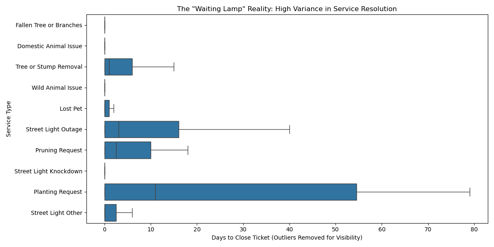

# Boston 311 Service Latency & Equity Analysis

 
 

## 1. Project Description 
Boston's 311 system handles over 250,000 requests annually. However, aggregate metrics (e.g., "Average Time to Close") often mask systemic inefficiencies. A "closed" ticket does not always mean a problem was solved efficiently.

This project moves beyond descriptive statistics to perform a **root-cause analysis** of service delays. We are conducting an **Equity-Focused Audit** of the city's infrastructure maintenance, specifically targeting the "Digital Divide" and "Socioeconomic Disparities."

**Why this matters:**
* **Equity:** Do vulnerable neighborhoods wait longer for street light repairs?
* **Efficiency:** Can we automatically detect "Long-Tail" anomalies that fall through the cracks?
* **Resilience:** How did the COVID-19 pandemic permanently alter the city's operational rhythm?

## 2. Project Goals 
Our goals are specific, measurable, and technically rigorous:

### Primary Goal: Quantify Equity (The $\beta$ Coefficient)
* **Objective:** Determine if neighborhood socioeconomic status (SVI) is a statistically significant predictor of service resolution time.
* **Measurable Metric:** We will quantify the regression coefficient ($\beta$) of the **CDC Social Vulnerability Index** on **Duration (Days)**, controlling for seasonality and request source.
* **Success Criteria:** A p-value < 0.05 for the SVI coefficient in our OLS model.

### Secondary Goal: Predict Anomalies (The Classifier)
* **Objective:** Build an "Early Warning System" to identify tickets at risk of becoming "Long-Tail" outliers (overdue by >30 days).
* **Measurable Metric:** Train a Logistic Regression/Decision Tree classifier.
* **Success Criteria:** Achieve >75% Recall on the test set for the "Overdue" class (prioritizing recall to minimize missed neglected cases).

## 3. Data Collection Plan (Rubric: 10 pts)
We have identified three distinct data sources and the specific methods to integrate them.

| Data Layer | Source | Collection Method | Key Features |
| :--- | :--- | :--- | :--- |
| **Operational** | **Analyze Boston (CKAN API)** | **Python API Script:** Automated fetching of JSON data (2015-Present). | `open_dt`, `closed_dt`, `lat`, `long`, `case_status`, `source` |
| **Demographic** | **CDC / Census Bureau** | **Spatial Join (GeoPandas):** Mapping request coordinates (Points) to Census Tracts (Polygons). | `SVI_Score`, `Median_Income`, `Minority_Pct` |
| **Civic** | **Boston Voter Files** | **Aggregation:** Aggregating voting history by Ward/Precinct. | `Voter_Turnout_Pct`, `Registered_Voters` |

---

## 4. Preliminary Analysis 
*See `notebooks/eda.ipynb` for full code.*

### The "Equity Gap" Visualized

*Figure 1: Residents in the North End wait significantly longer for street light repairs than other neighborhoods.*

### The "Long Tail" Problem

*Figure 2: Boxplots reveal massive variance. While median times are low, the "long tail" of neglected cases extends for months.*

### The Structural Break TODO
![Structural Break]

## 5. Project Roadmap & Timeline
We have structured the project to fit the 8-week semester timeline, with built-in buffers for contingencies.

* **Week 1-2: Data Engineering (Current Phase)**
    * Set up GitHub Repo & Environment.
    * Write ETL script to fetch 311 data via API.
    * Perform Spatial Join with Census SVI Shapefiles.
* **Week 3: EDA & Feature Engineering**
    * Visualize "Structural Break" (COVID-19 analysis).
    * Handle missing values using k-NN imputation.
* **Week 4: Unsupervised Learning (Clustering)**
    * Apply k-Means to categorize 175+ request types into "Critical" vs "Routine".
* **Week 5: Text Mining (SVD)**
    * Run SVD on `case_description` to extract latent topics.
* **Week 6: Regression Modeling**
    * Train Multivariate OLS Model (Testing Equity Hypothesis).
    * Train Logistic Regression (Anomaly Detection).
* **Week 7: Visualization & Dashboard**
    * Build Streamlit App for interactive exploration.
* **Week 8: Final Report**
    * Finalize documentation and presentation.

> **Contingency Plan:** 
If the "Voter Turnout" data (Extension) proves too difficult to map due to inconsistent ward boundaries, we will focus exclusively on the Census SVI (Base Goal) to ensure timely delivery.

